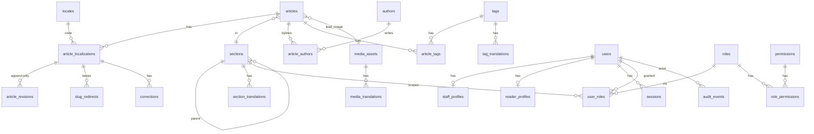

# 02 — Data Model and Schema

## Conventions

- Primary keys: `uuid`, generated application-side as **UUIDv7** (time-sortable, index-friendly).
- Timestamps: `timestamptz`, always UTC. `created_at` / `updated_at` default to `now()`.
- Status-like columns: native Postgres enums (`ALTER TYPE ... ADD VALUE` is cheap to extend).
- Translatable entities follow one pattern: `<entity>` (language-neutral) + `<entity>_translations`
  with `UNIQUE (<entity>_id, locale)` and `locale` → `locales.code`.
- Soft deletion only where it is a real business state (`deleted_at`); never for published content.
- Constraint names follow a fixed naming convention (`pk_`, `fk_`, `uq_`, `ix_`, `ck_`) so
  Alembic diffs are stable.
- Money, if it ever appears, is `numeric` + currency code, never float.

## ERD

## Phase 1 tables (first migration)

### `locales`
| column | type | notes |
|---|---|---|
| code | `varchar(10)` PK | BCP 47, e.g. `ar`, `en` |
| name | `varchar(64)` | English name |
| native_name | `varchar(64)` | e.g. `العربية` |
| direction | enum `text_direction` (`ltr`, `rtl`) | drives `<html dir>` |
| is_default | `bool` | partial unique index: only one `true` |
| is_enabled | `bool` | disabled locales are hidden from public routes |
| sort_order | `int` | |

### `users` — login identity only
| column | type | notes |
|---|---|---|
| id | `uuid` PK | |
| email | `varchar(320)` | stored lowercase; `UNIQUE` |
| password_hash | `varchar(255)` NULL | NULL allowed for future OAuth-only readers |
| kind | enum `user_kind` (`reader`, `staff`) | |
| status | enum `user_status` (`pending`, `active`, `suspended`, `deactivated`) | |
| email_verified_at | `timestamptz` NULL | |
| last_login_at | `timestamptz` NULL | |
| created_at / updated_at | `timestamptz` | |

Index: `ix_users_kind_status (kind, status)`.

### `staff_profiles` (1:1 with staff users)
| column | type | notes |
|---|---|---|
| user_id | `uuid` PK, FK → users ON DELETE CASCADE | |
| display_name | `varchar(120)` | |
| job_title | `varchar(120)` NULL | |
| bio | `text` NULL | |
| preferred_locale | FK → locales.code NULL | admin UI language |

### `reader_profiles` (1:1 with reader users)
| column | type | notes |
|---|---|---|
| user_id | `uuid` PK, FK → users ON DELETE CASCADE | |
| display_name | `varchar(120)` NULL | |
| preferred_locale | FK → locales.code NULL | |
| preferences | `jsonb` default `{}` | topics, notification settings |
| newsletter_opt_in | `bool` default false | |

### `sessions` — revocable server-side sessions and API tokens
| column | type | notes |
|---|---|---|
| id | `uuid` PK | |
| user_id | FK → users ON DELETE CASCADE | |
| token_hash | `bytea` UNIQUE | SHA-256 of the opaque token; raw token is never stored |
| kind | enum `session_kind` (`reader_web`, `staff_web`, `api_token`) | |
| name | `varchar(120)` NULL | label for API tokens |
| created_at | `timestamptz` | |
| last_seen_at | `timestamptz` | touched at most once per minute |
| expires_at | `timestamptz` | |
| revoked_at | `timestamptz` NULL | |
| ip | `inet` NULL | at creation |
| user_agent | `varchar(512)` NULL | |

Index: `ix_sessions_user_id`, `ix_sessions_expires_at`.

### `sections` (created in phase 1 because `user_roles.section_id` references it; management ships in the sections slice)
| column | type | notes |
|---|---|---|
| id | `uuid` PK | |
| parent_id | FK → sections NULL ON DELETE RESTRICT | hierarchy |
| key | `varchar(64)` UNIQUE | stable, language-neutral identifier (`politics`) |
| sort_order | `int` | |
| is_active | `bool` | |
| created_at / updated_at | `timestamptz` | |

### `section_translations`
| column | type | notes |
|---|---|---|
| id | `uuid` PK | |
| section_id | FK → sections ON DELETE CASCADE | |
| locale | FK → locales.code | |
| name | `varchar(120)` | |
| slug | `varchar(160)` | `UNIQUE (locale, slug)` |
| description | `text` NULL | |

`UNIQUE (section_id, locale)`.

### `permissions`
| column | type | notes |
|---|---|---|
| code | `varchar(64)` PK | e.g. `article.publish`; defined in code (`authz/permissions.py`) |
| description | `varchar(255)` | |

### `roles`
| column | type | notes |
|---|---|---|
| id | `uuid` PK | |
| key | `varchar(64)` UNIQUE | `writer`, `editor`, `admin`, `super_admin` |
| name | `varchar(120)` | |
| description | `text` NULL | |
| is_system | `bool` | system roles cannot be deleted or renamed |
| rank | `int` | privilege ordering for "cannot manage someone above you" checks |

### `role_permissions`
`(role_id FK → roles ON DELETE CASCADE, permission_code FK → permissions ON DELETE CASCADE)` composite PK.

### `user_roles`
| column | type | notes |
|---|---|---|
| id | `uuid` PK | |
| user_id | FK → users ON DELETE CASCADE | |
| role_id | FK → roles ON DELETE CASCADE | |
| section_id | FK → sections NULL ON DELETE CASCADE | NULL = global grant |
| granted_by | FK → users NULL ON DELETE SET NULL | |
| created_at | `timestamptz` | |

Uniqueness: `UNIQUE NULLS NOT DISTINCT (user_id, role_id, section_id)` (Postgres 15+).

### `audit_events` — append-only
| column | type | notes |
|---|---|---|
| id | `uuid` PK | UUIDv7 gives chronological order |
| occurred_at | `timestamptz` | |
| actor_id | FK → users NULL ON DELETE SET NULL | NULL = system/worker |
| action | `varchar(64)` | `article.published`, `user.role_granted`, … |
| entity_type | `varchar(64)` | `article_localization`, `user`, … |
| entity_id | `varchar(64)` | string so non-UUID keys (locale codes) fit |
| before | `jsonb` NULL | |
| after | `jsonb` NULL | |
| reason | `text` NULL | required for takedowns, purges |
| ip | `inet` NULL | |
| request_id | `varchar(64)` NULL | ties the event to the log line |

Indexes: `(entity_type, entity_id, occurred_at)`, `(actor_id, occurred_at)`, `(action, occurred_at)`.
The application role gets `INSERT, SELECT` only on this table in production (no `UPDATE/DELETE`).

## Phase 2 tables (designed now, migrated in their slices)

### `authors` — bylines
`id`, `user_id` FK → users NULL UNIQUE, `kind` enum (`staff`, `contributor`, `agency`), `key` UNIQUE,
`created_at`. Plus `author_translations (author_id, locale, display_name, bio, slug)`.

### `tags` / `tag_translations`
`tags(id, key UNIQUE, created_at)`; `tag_translations(tag_id, locale, name, slug)` with
`UNIQUE (tag_id, locale)` and `UNIQUE (locale, slug)`.

### `media_assets` / `media_translations`
`media_assets(id, storage_key, mime_type, width, height, byte_size, credit, uploaded_by, created_at)`;
`media_translations(media_id, locale, caption, alt_text)`.

### `articles` — language-neutral container
| column | type | notes |
|---|---|---|
| id | `uuid` PK | |
| section_id | FK → sections | drives section-scoped permissions |
| article_type | enum (`news`, `opinion`, `analysis`, `feature`, `interview`) | |
| lead_media_id | FK → media_assets NULL | |
| is_breaking | `bool` | |
| created_by | FK → users | ownership for writer policies |
| created_at / updated_at | `timestamptz` | |

Join tables: `article_authors(article_id, author_id, position)`, `article_tags(article_id, tag_id)`.

### `article_localizations` — the publishable unit
| column | type | notes |
|---|---|---|
| id | `uuid` PK | |
| article_id | FK → articles ON DELETE RESTRICT | |
| locale | FK → locales.code | `UNIQUE (article_id, locale)` |
| slug | `varchar(200)` | `UNIQUE (locale, slug)` |
| status | enum `article_status` | see 04-workflow.md |
| current_revision_id | FK → article_revisions NULL | latest working copy |
| published_revision_id | FK → article_revisions NULL | what readers see |
| publish_at | `timestamptz` NULL | set when `scheduled` |
| unpublish_at | `timestamptz` NULL | embargo expiry |
| published_at | `timestamptz` NULL | last (re)publication |
| first_published_at | `timestamptz` NULL | never changes once set |
| update_requested_at | `timestamptz` NULL | writer proposed an update to a live article |
| lock_version | `int` | optimistic concurrency on metadata changes |
| search_vector | `tsvector` NULL | built with `arabic`/`english` config per locale |
| legal_hold | `bool` | publish and schedule are refused until cleared |
| deleted_at | `timestamptz` NULL | only allowed when `first_published_at IS NULL` |
| created_at / updated_at | `timestamptz` | |

Indexes: `(status, publish_at) WHERE status = 'scheduled'`, `(status, unpublish_at) WHERE unpublish_at IS NOT NULL`,
`(locale, published_at DESC) WHERE status = 'published'`, GIN on `search_vector`.
Check: `ck_deleted_never_published`: `deleted_at IS NULL OR first_published_at IS NULL`.

### `article_revisions` — immutable
| column | type | notes |
|---|---|---|
| id | `uuid` PK | |
| localization_id | FK → article_localizations ON DELETE RESTRICT | |
| revision_no | `int` | `UNIQUE (localization_id, revision_no)` |
| parent_revision_id | FK → article_revisions NULL | base the editor started from |
| restored_from_id | FK → article_revisions NULL | set when created via restore |
| kind | enum (`manual`, `autosave`, `restore`, `system`) | autosaves are coalesced |
| title / subtitle / excerpt | `varchar` / `text` | |
| body | `jsonb` | editor document (source of truth) |
| body_html | `text` | sanitized render cache |
| seo_title / seo_description | `varchar` NULL | |
| change_note | `varchar(500)` NULL | |
| created_by | FK → users | |
| created_at | `timestamptz` | |

No `updated_at`: rows are never updated. The app role has no `UPDATE` grant in production.

### `slug_redirects`
`(locale, old_slug) PK`, `localization_id` FK, `created_at`. Checked before a public 404.

### `corrections`
`id`, `localization_id` FK, `kind` enum (`correction`, `clarification`, `update`), `text`,
`created_by`, `created_at`. Displayed publicly on the article, with the kind as the label.
A correction is a factual fix. A clarification adds context without admitting an error.
An update marks a developing story ("this story was updated at 14:10 to include the ministry statement").

`article_localizations` also carries `legal_hold boolean` (default false). It is not a workflow
status: the story stays where it is, and publish/schedule are blocked until an editor records
clearance (`article.clear_legal`). Takedowns store `TakedownReason` on the audit event, not as a
column, so the reason travels with the history.

## Concurrency model

- **Content saves** send `base_revision_id`. If it differs from `current_revision_id`,
  the save fails with `409 Conflict` and the client shows a diff.
- **Metadata/status changes** use `lock_version` (`UPDATE ... WHERE lock_version = :v`).
- **Scheduler** claims rows with `FOR UPDATE SKIP LOCKED`, so parallel workers never double-publish.
