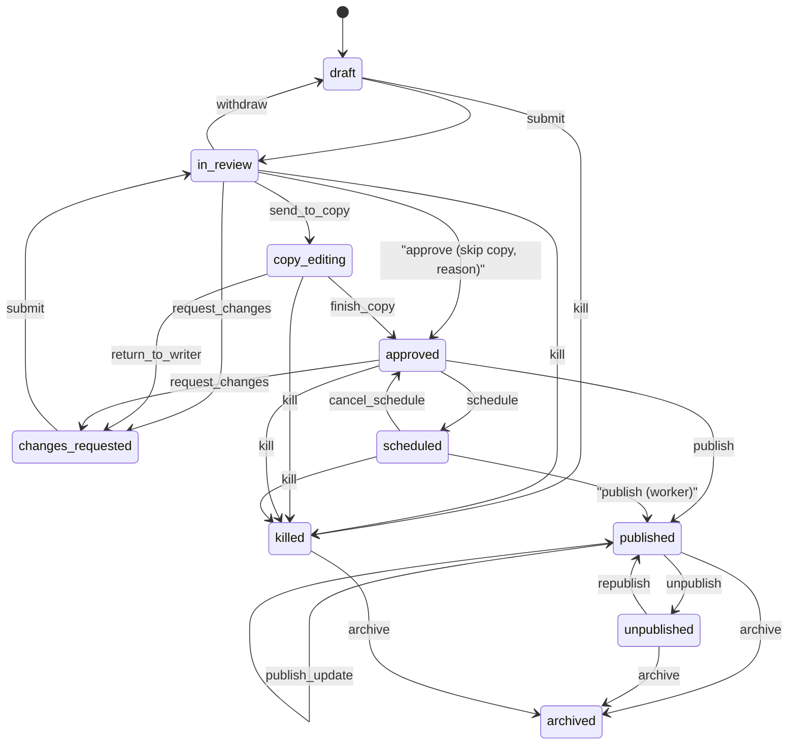

# 04 — Article Workflow, Versioning and Audit

Workflow runs **per localization** (`article_localizations.status`), so the Arabic version can be
published while the English version is still being translated or reviewed.

## States

| Status | Meaning | Visible to readers |
|---|---|---|
| `draft` | Being written | no |
| `in_review` | Submitted to the desk editor (news judgment) | no |
| `copy_editing` | Desk accepted it; copy desk has the text | no |
| `changes_requested` | Sent back to the writer with a note | no |
| `approved` | Copy signed off, or copy skipped; ready to publish | no |
| `scheduled` | Goes live at `publish_at` | no |
| `published` | Live; readers see `published_revision_id` | yes |
| `unpublished` | Was live, taken down with a reason and a reason code; URL returns 410 | no (notice only) |
| `killed` | Spiked before it ever went live, with a reason. Kept for the record | no |
| `archived` | Off the active desks, kept for records | no |

Soft deletion (`deleted_at`) is not a status. It is only for a draft that was never published.
A database check constraint enforces `deleted_at IS NULL OR first_published_at IS NULL`.

`legal_hold` is a boolean on the localization, not a status. Most stories never see a lawyer.
While it is true, publish and schedule are refused until `article.clear_legal` is recorded.



## Transition table

This table is the single source of truth. It is implemented verbatim in
`src/newsroom/articles/workflow.py`, and unit tests cover every edge.
Concrete newsroom walkthroughs are in [06-editorial-scenarios.md](06-editorial-scenarios.md).

| Action | From | To | Permission | Reason | Notes |
|---|---|---|---|---|---|
| `submit` | draft, changes_requested | in_review | `article.submit` | no | writer must own it unless they hold `article.edit` |
| `withdraw` | in_review | draft | `article.submit` | no | same ownership rule. Not available once it is on the copy desk |
| `send_to_copy` | in_review | copy_editing | `article.review` | no | the normal path |
| `return_to_writer` | copy_editing | changes_requested | `article.copy` | yes | copy desk sends it back |
| `finish_copy` | copy_editing | approved | `article.copy` | no | language signed off. Does not publish |
| `request_changes` | in_review, copy_editing, approved | changes_requested | `article.review` | yes | desk editor sends it back |
| `approve` | in_review | approved | `article.review` | yes | skips copy. Used for breaking news; the reason is the audit |
| `schedule` | approved | scheduled | `article.publish` | no | `publish_at` in the future. Refused while `legal_hold` |
| `cancel_schedule` | scheduled | approved | `article.publish` | no | |
| `publish` | approved, scheduled | published | `article.publish` | no | worker may publish `scheduled`. Refused while `legal_hold` |
| `publish_update` | published | published | `article.publish` | no | moves `published_revision_id` to the working revision |
| `unpublish` | published | unpublished | `article.unpublish` | yes | also a `TakedownReason`: legal, major_error, duplicate, safety, other |
| `republish` | unpublished | published | `article.publish` | no | |
| `kill` | draft, in_review, copy_editing, changes_requested, approved, scheduled | killed | `article.review` | yes | spike. Impossible if the story was ever published |
| `archive` | published, unpublished, killed | archived | `article.archive` | no | |
| `unarchive` | archived | unpublished | `article.archive` | no | |
| `delete` | draft, changes_requested | *(soft-deleted)* | `article.delete_draft` | no | never-published only. Prefer `kill` when an editor spikes it |

Side effects on publish:
- set `published_revision_id = current_revision_id`
- set `published_at = now()`
- set `first_published_at` if NULL
- clear `publish_at` and `update_requested_at`

## Versioning

- **Revisions are immutable.** Every manual save appends a revision.
- **Autosaves** by the same user within 5 minutes and with no manual save in between are
  coalesced: the latest autosave row is replaced. This is the only case where an existing row
  changes, and the only rows it can touch are unpublished, unreferenced autosave rows.
- **Working copy vs live copy.** `current_revision_id` is what editors see. `published_revision_id`
  is what readers see. Editing a published article never changes the live page until `publish_update`.
- **Restore** copies revision N into a new revision (`kind = restore`, `restored_from_id = N`).
  History is never rewritten.
- **Diffs** are computed on demand between any two revisions of a localization: field-level for
  title/subtitle/SEO, block-level for body.
- **Concurrency.** A save carries `base_revision_id`. If it is not the current revision, the API
  returns `409 Conflict` with both revision IDs so the UI can show a diff and let the user merge.

## Audit

Every transition, save, restore, correction and permission change writes an `audit_events` row in
the same database transaction as the change:

```
action        = "article.unpublish"
entity_type   = "article_localization"
entity_id     = <localization id>
actor_id      = <user id, or NULL for the worker>
before/after  = {"status": "published"} / {"status": "unpublished"}
reason        = "Legal request #123"
after.takedown_reason = "legal"
request_id    = <X-Request-ID>
```

The dashboard's "History" tab for an article merges its revisions and audit events into one
timeline: who wrote what, who approved it, when it went live, who took it down and why.

## Scheduler

`python -m newsroom.worker` runs a loop every `WORKER_POLL_SECONDS` (default 30):

```sql
SELECT id FROM article_localizations
WHERE status = 'scheduled' AND publish_at <= now()
ORDER BY publish_at
LIMIT 50
FOR UPDATE SKIP LOCKED;
```

Each row is published in its own transaction with an audit event (`actor_id = NULL`,
`action = article.publish`, `after.via = "scheduler"`). The job is idempotent because the
status check is part of the claim. An equivalent job handles `unpublish_at <= now()` for
published rows. Multiple worker replicas are safe.
